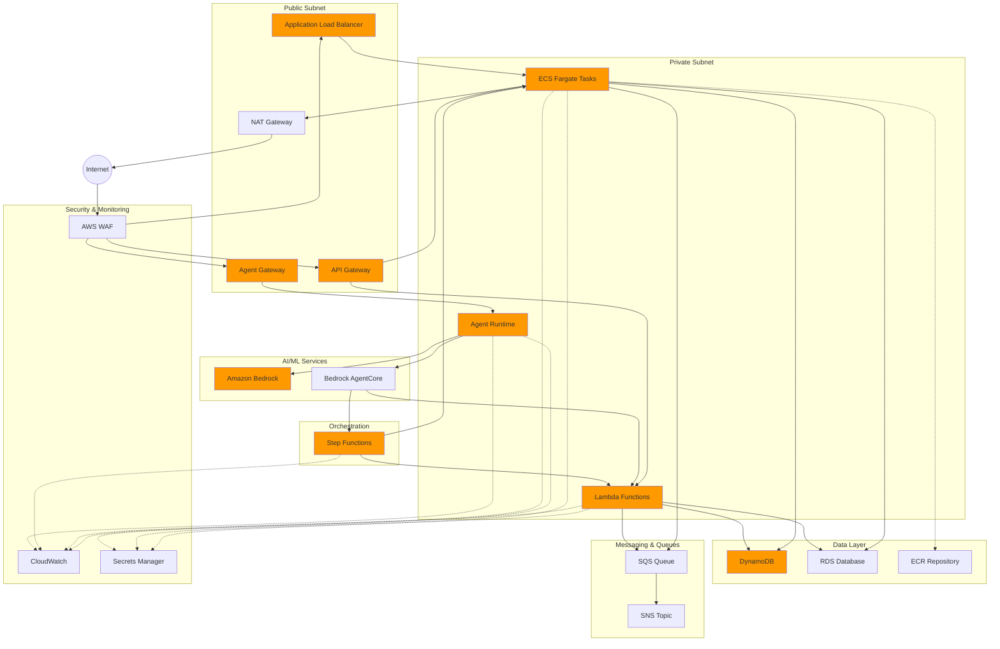
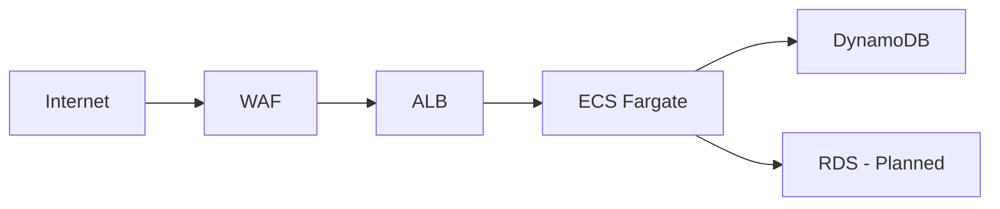
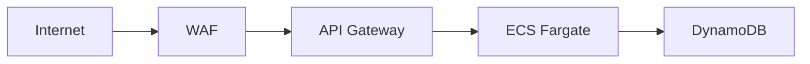
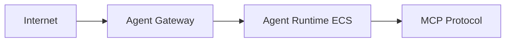
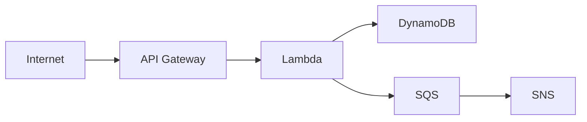
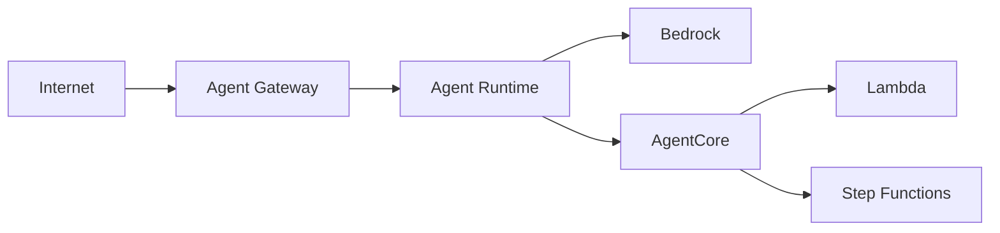

# AWS Serverless Architecture

This document provides an interactive view of the complete AWS serverless architecture supported by this module collection.

## Architecture Diagram

## Component Status

### Currently Available Modules
- VPC - Multi-AZ networking with NAT gateways
- ECS - Fargate container orchestration
- ALB - Application Load Balancer
- API Gateway - HTTP API (v2) and REST API (v1)
- DynamoDB - NoSQL database
- ECR - Container registry
- WAF - Web Application Firewall
- CloudWatch - Monitoring and alarms
- CloudFront + S3 - CDN and static hosting

### Planned Modules
- Lambda - Serverless functions
- RDS - Relational database
- SQS - Message queuing
- SNS - Pub/sub messaging
- Step Functions - Workflow orchestration
- Agent Gateway - AI agent API gateway
- Agent Runtime - AI agent execution environment
- Bedrock Integration - Foundation model access
- AgentCore - Bedrock agent orchestration

## Architecture Patterns

### Container-Based Pattern (Available Now)

### API Gateway Pattern (Available Now)

### Agent Runtime Pattern (Available Now)

### Serverless Pattern (Planned)

### AI/ML Pattern (Planned)

## Related Documentation

- [Well-Architected Framework](https://github.com/jonmatum/terraform-aws-serverless-modules/tree/main/docs/well-architected.md)
- [Module Documentation](https://github.com/jonmatum/terraform-aws-serverless-modules/tree/main/modules)
- [Example Implementations](https://github.com/jonmatum/terraform-aws-serverless-modules/tree/main/examples)
