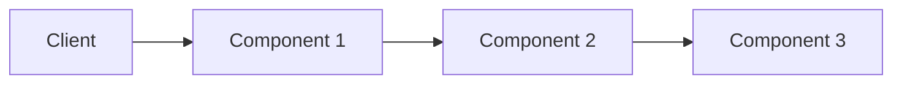

# Example Name

Brief description of what this example demonstrates.

## Architecture



## Features

- Feature 1
- Feature 2
- Feature 3

## Prerequisites

- Terraform >= 1.0
- AWS CLI configured
- Docker (if building images)

## Deployment

### Quick Start

```bash
cd examples/example-name
./deploy.sh
```

### Manual Deployment

#### Step 1: Initialize Terraform

```bash
terraform init
```

#### Step 2: Create Infrastructure

```bash
terraform apply -auto-approve
```

#### Step 3: Build and Push (if applicable)

```bash
./build-and-push.sh
```

## Testing

```bash
# Get endpoint
ENDPOINT=$(terraform output -raw endpoint)

# Test endpoint
curl $ENDPOINT/health
```

## Redeployment

After making code changes:

```bash
./redeploy.sh

# Or with specific tag
IMAGE_TAG=v1.2.3 ./redeploy.sh
```

## Configuration

### Environment Variables

| Variable | Description | Default |
|----------|-------------|---------|
| AWS_REGION | AWS region | us-east-1 |
| IMAGE_TAG | Docker image tag | latest |

### Terraform Variables

See `variables.tf` for all available variables.

## Cost Estimate

Approximate monthly cost: $XX-XX

**Breakdown:**
- Component 1: $XX
- Component 2: $XX
- Component 3: $XX

## Cleanup

```bash
terraform destroy -auto-approve
```

## Troubleshooting

### Issue 1

**Problem**: Description of problem

**Solution**: How to fix it

### Issue 2

**Problem**: Description of problem

**Solution**: How to fix it

## Next Steps

- Suggestion 1
- Suggestion 2
- Suggestion 3

## Related Examples

- [example-1](../example-1/) - Description
- [example-2](../example-2/) - Description

<!-- BEGINNING OF PRE-COMMIT-TERRAFORM DOCS HOOK -->
<!-- Terraform docs will be automatically generated here -->
<!-- END OF PRE-COMMIT-TERRAFORM DOCS HOOK -->
