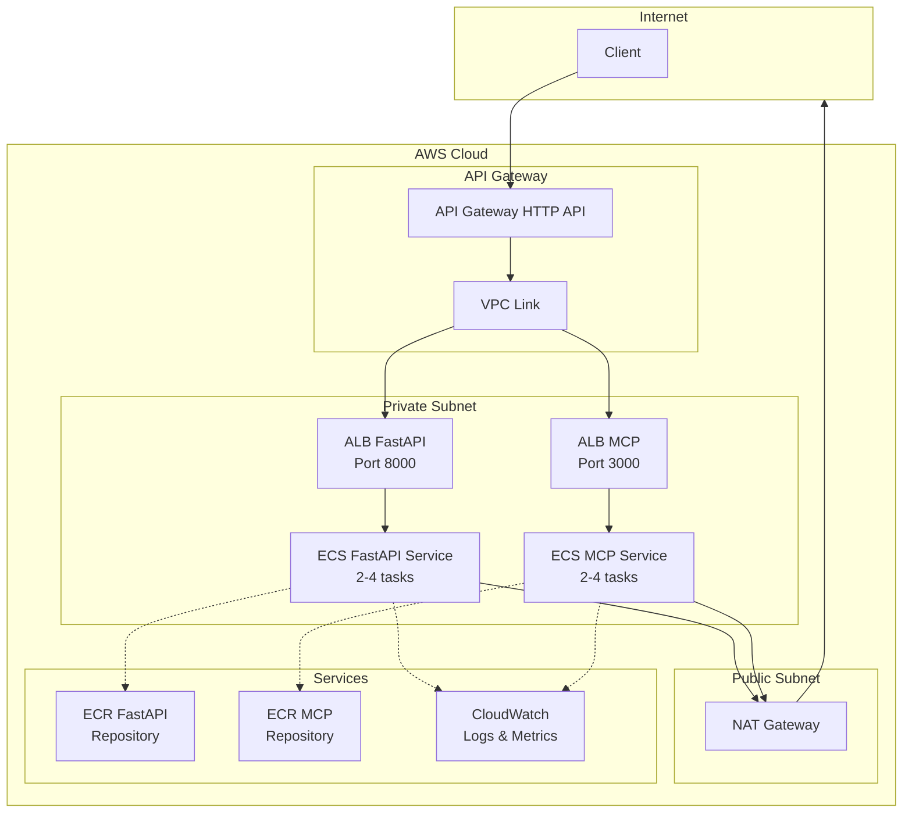
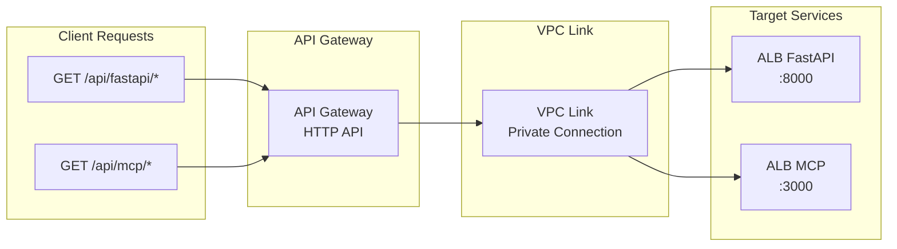
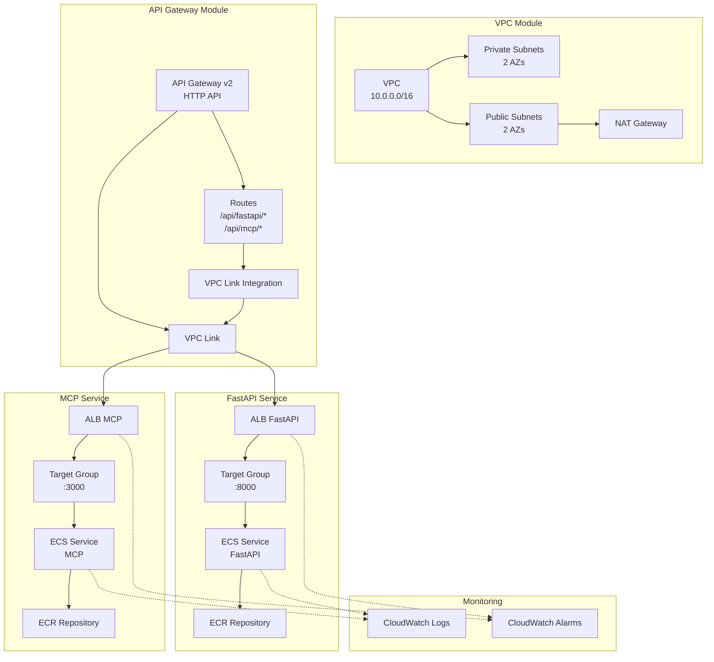
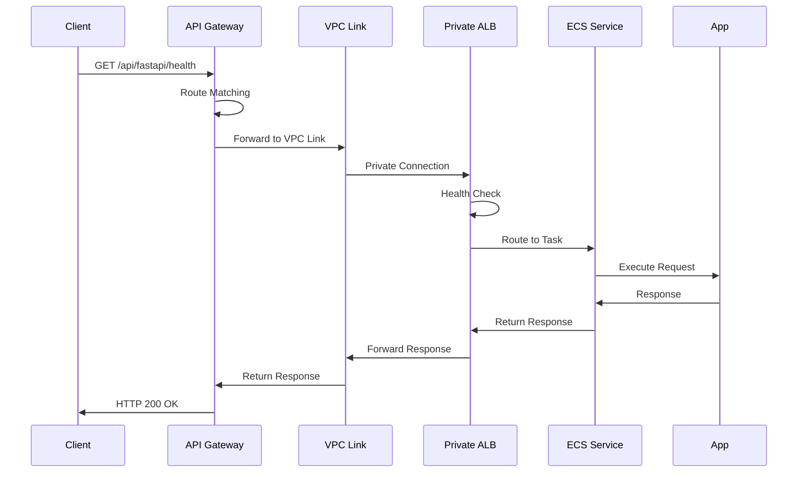
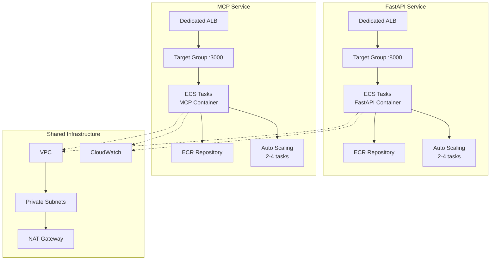
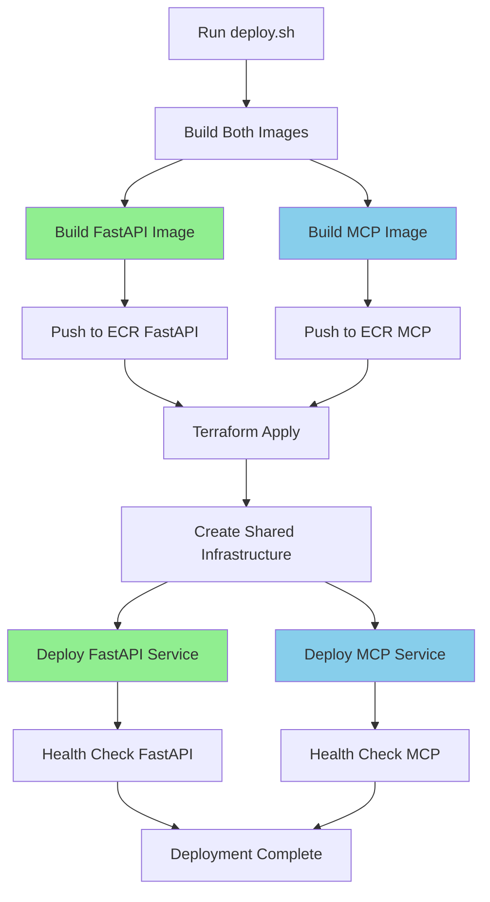
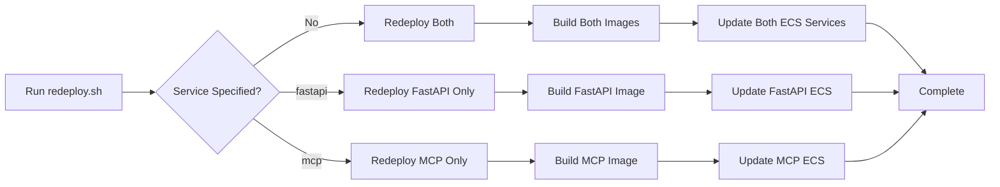

# Multi-Service API Gateway Architecture

This document provides a detailed architecture view of the multi-service API Gateway example.

## High-Level Architecture

## API Gateway Routing

## Terraform Resources

## Request Flow

## Service Isolation

## Deployment Strategies

## Redeploy Flow

## Cost Breakdown

| Component | Monthly Cost | Notes |
|-----------|--------------|-------|
| NAT Gateway | ~$32 | Single NAT for dev |
| API Gateway | ~$3.50 | 1M requests |
| VPC Link | ~$22 | Per VPC Link |
| Fargate FastAPI (2x) | ~$30 | 0.25 vCPU, 0.5 GB each |
| Fargate MCP (2x) | ~$30 | 0.25 vCPU, 0.5 GB each |
| ALB FastAPI | ~$20 | Includes data processing |
| ALB MCP | ~$20 | Includes data processing |
| ECR Storage | ~$2 | 5 images per service |
| CloudWatch Logs | ~$10 | 7-day retention |
| Data Transfer | Variable | Depends on traffic |
| **Total** | **~$169/month** | Development configuration |

## Related Documentation

- [Main README](./README.md)
- [VPC Module](../../modules/vpc/)
- [API Gateway Module](../../modules/api-gateway/)
- [ECS Module](../../modules/ecs/)
- [ALB Module](../../modules/alb/)
