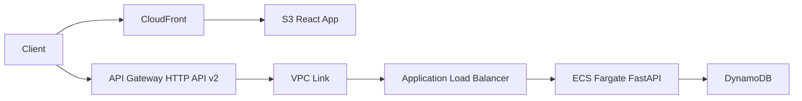

# CRUD API with HTTP API (API Gateway v2) + React Frontend

**Optimized** CRUD application with FastAPI backend, DynamoDB, API Gateway HTTP API, and React frontend on CloudFront.

## Architecture



## Why HTTP API (v2)?

- **71% cheaper** than REST API
- **No NLB required** - connects directly to ALB
- **Lower latency** - one less network hop
- **Simpler architecture** - fewer components
- **Still supports** OpenAPI, CORS, JWT auth, custom domains

### When to Use HTTP API vs REST API

| Feature | HTTP API (v2) | REST API (v1) |
|---------|---------------|---------------|
| Cost | Cheaper | More expensive |
| Latency | Lower | Higher (NLB hop) |
| ALB Integration | Direct | Requires NLB |
| API Keys | No | Yes |
| Request Validation | Limited | Full |
| Usage Plans | No | Yes |
| SDK Generation | No | Yes |

**Use this example** for most modern APIs. Use REST API only if you need API keys, usage plans, or request validation.

## Features

### Backend (FastAPI)
- Full CRUD operations
- DynamoDB integration
- Pydantic validation
- OpenAPI/Swagger documentation
- Health check endpoint
- CORS support

### Infrastructure
- API Gateway HTTP API (v2)
- VPC Link for private integration (no NLB!)
- DynamoDB with encryption & PITR
- ECS Fargate with auto-scaling
- CloudFront + S3 for React app
- WAF protection (optional)
- CloudWatch Logs & monitoring
- X-Ray tracing support

### Frontend (React)
- Item list view
- Create/Edit forms
- Delete confirmation
- API integration
- Responsive design

## Quick Start

### 1. Deploy Infrastructure & Backend

```bash
./deploy.sh
```

This will:
1. Create all AWS infrastructure
2. Build and push FastAPI Docker image
3. Deploy ECS service
4. Output API endpoint and test commands

### 2. Test API

```bash
# Get API endpoint
export API_URL=$(terraform output -raw api_endpoint)

# Create an item
curl -X POST $API_URL/items \
  -H "Content-Type: application/json" \
  -d '{
    "name": "Laptop",
    "description": "MacBook Pro 16-inch",
    "price": 2499.99,
    "quantity": 10
  }'

# List all items
curl $API_URL/items

# Get specific item
curl $API_URL/items/{item-id}

# Update item
curl -X PUT $API_URL/items/{item-id} \
  -H "Content-Type: application/json" \
  -d '{"price": 2299.99}'

# Delete item
curl -X DELETE $API_URL/items/{item-id}

# Health check
curl $API_URL/health

# Open API documentation
open $API_URL/docs
```

## API Endpoints

| Method | Path | Description |
|--------|------|-------------|
| GET | `/` | API root |
| GET | `/health` | Health check |
| GET | `/docs` | Swagger UI |
| GET | `/redoc` | ReDoc UI |
| POST | `/items` | Create item |
| GET | `/items` | List all items |
| GET | `/items/{id}` | Get item by ID |
| PUT | `/items/{id}` | Update item |
| DELETE | `/items/{id}` | Delete item |

## Configuration

### Enable WAF

```hcl
# variables.tf or terraform.tfvars
enable_waf = true
```

### Customize Settings

```hcl
# variables.tf
variable "project_name" {
  default = "my-crud-api"
}

variable "aws_region" {
  default = "us-west-2"
}
```

## Cost Estimate

**Development** (~$65-85/month):
- DynamoDB: $1-5 (PAY_PER_REQUEST)
- ECS Fargate: $15-30
- NAT Gateway: $32 (single)
- ALB: $16
- API Gateway HTTP API: $1.00/million requests (71% cheaper!)
- CloudFront: $0.085/GB
- S3: $0.023/GB

**Production** (~$195-410/month):
- DynamoDB: $10-50
- ECS Fargate: $60-120 (auto-scaling)
- NAT Gateway: $64 (multi-AZ)
- ALB: $16
- API Gateway HTTP API: Lower cost with traffic
- WAF: $5 + $1/million requests

**Savings vs REST API**: ~$16/month (no NLB required)

## Cost Comparison

| Component | HTTP API (v2) | REST API (v1) | Savings |
|-----------|---------------|---------------|---------|
| API Gateway | $1.00/M | $3.50/M | 71% |
| Load Balancers | $16 (ALB) | $32 (NLB+ALB) | $16/mo |
| **Total Fixed** | **~$65/mo** | **~$85/mo** | **~$20/mo** |

## Cleanup

```bash
terraform destroy -auto-approve
```

## Well-Architected Compliance

- **Security**: Encryption, IAM least privilege, VPC endpoints, WAF
- **Reliability**: Multi-AZ, auto-scaling, health checks, PITR
- **Performance**: Fargate, DynamoDB PAY_PER_REQUEST, CloudFront, direct ALB integration
- **Cost**: HTTP API (71% cheaper), auto-scaling, lifecycle policies
- **Operations**: IaC, logging, monitoring, X-Ray tracing
- **Sustainability**: Fewer resources (no NLB), lower carbon footprint

## Comparison with REST API Example

| Aspect | HTTP API (this) | REST API |
|--------|-----------------|----------|
| Architecture | API GW → ALB → ECS | API GW → NLB → ALB → ECS |
| Components | 3 hops | 4 hops |
| Monthly Cost | ~$65 | ~$85 |
| Latency | Lower | Higher (+1-3ms) |
| API Keys | No | Yes |
| Usage Plans | No | Yes |
| Request Validation | Limited | Full |

## When to Use Each

### Use HTTP API (this example) when:
- Building modern REST APIs
- Cost optimization is important
- Don't need API keys or usage plans
- Want simpler architecture
- Need lower latency

### Use REST API when:
- Need API keys and usage plans
- Need request/response transformation
- Need request validation
- Need SDK generation
- Legacy compatibility required

## Troubleshooting

### ECS Service Won't Start
```bash
# Check ECS service events
aws ecs describe-services \
  --cluster $(terraform output -raw cluster_name) \
  --services $(terraform output -raw service_name)

# Check CloudWatch logs
aws logs tail /ecs/crud-api-http-api --follow
```

### API Gateway Returns 500
```bash
# Check ALB target health
aws elbv2 describe-target-health \
  --target-group-arn $(terraform output -raw target_group_arn)
```

### DynamoDB Access Denied
- Verify ECS task role has DynamoDB permissions
- Check table name environment variable

## Next Steps

1. Add authentication (Cognito JWT)
2. Add CI/CD pipeline
3. Add integration tests
4. Add monitoring dashboards
5. Add custom domain
6. Add rate limiting
