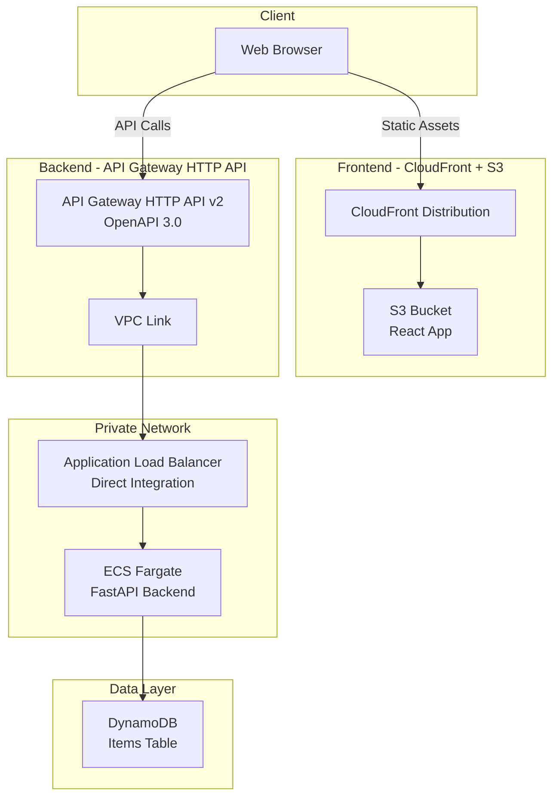
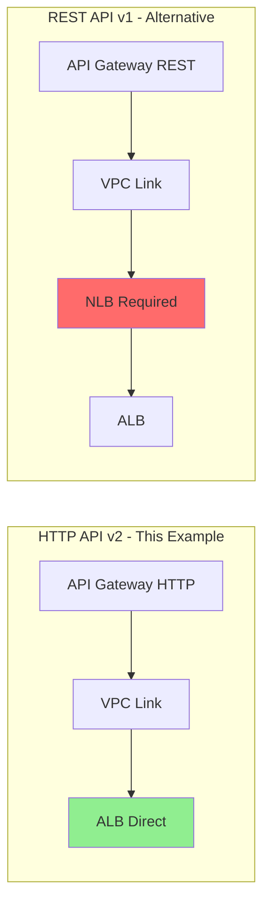
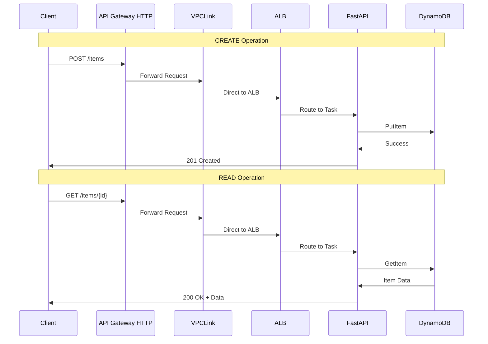
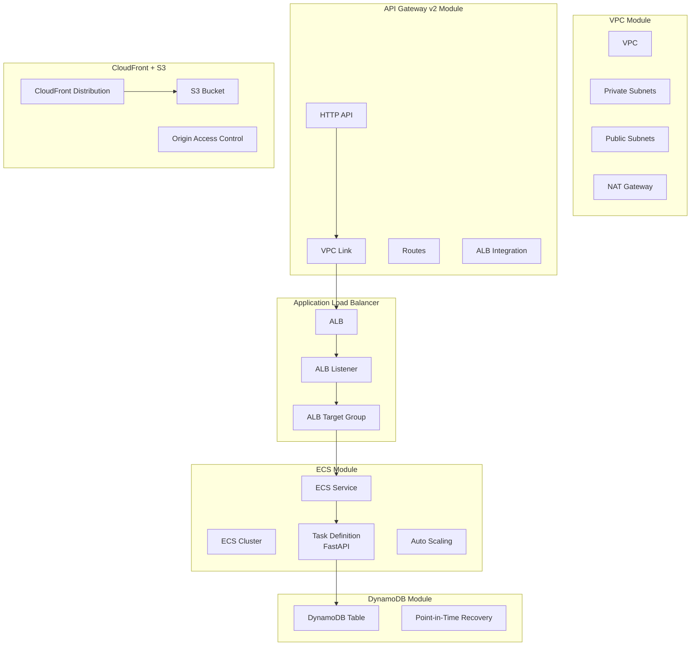

# CRUD API HTTP Architecture

This document provides a detailed architecture view of the CRUD API with HTTP API Gateway and React frontend.

## High-Level Architecture

## HTTP API vs REST API

## CRUD Operations Flow

## Terraform Resources

## Cost Breakdown

| Component | Monthly Cost | Notes |
|-----------|--------------|-------|
| NAT Gateway | ~$32 | Single NAT for dev |
| API Gateway HTTP API | ~$1 | 1M requests (71% cheaper than REST) |
| VPC Link | ~$22 | Per VPC Link |
| Application Load Balancer | ~$20 | No NLB needed |
| Fargate Tasks (2x) | ~$30 | 0.25 vCPU, 0.5 GB each |
| DynamoDB | ~$5 | On-demand, low traffic |
| CloudFront | ~$1 | 1GB transfer |
| S3 Storage | ~$0.50 | React app assets |
| ECR Storage | ~$1 | Container images |
| CloudWatch Logs | ~$5 | 7-day retention |
| **Total** | **~$117/month** | Development configuration |

**Savings vs REST API**: ~$19/month (no NLB required, cheaper API Gateway pricing)

## Related Documentation

- [Main README](./README.md)
- [API Gateway v2 Module](../../modules/api-gateway/)
- [DynamoDB Module](../../modules/dynamodb/)
- [CloudFront + S3 Module](../../modules/cloudfront-s3/)
- [ECS Module](../../modules/ecs/)
