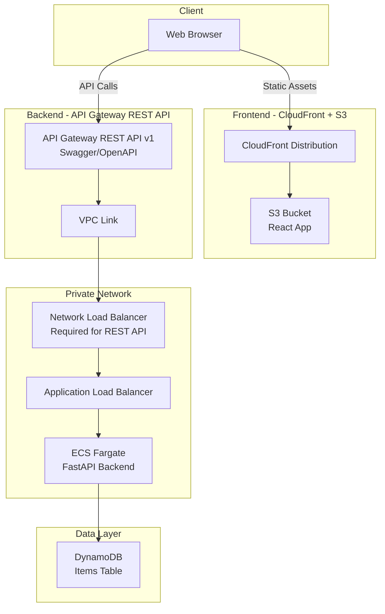
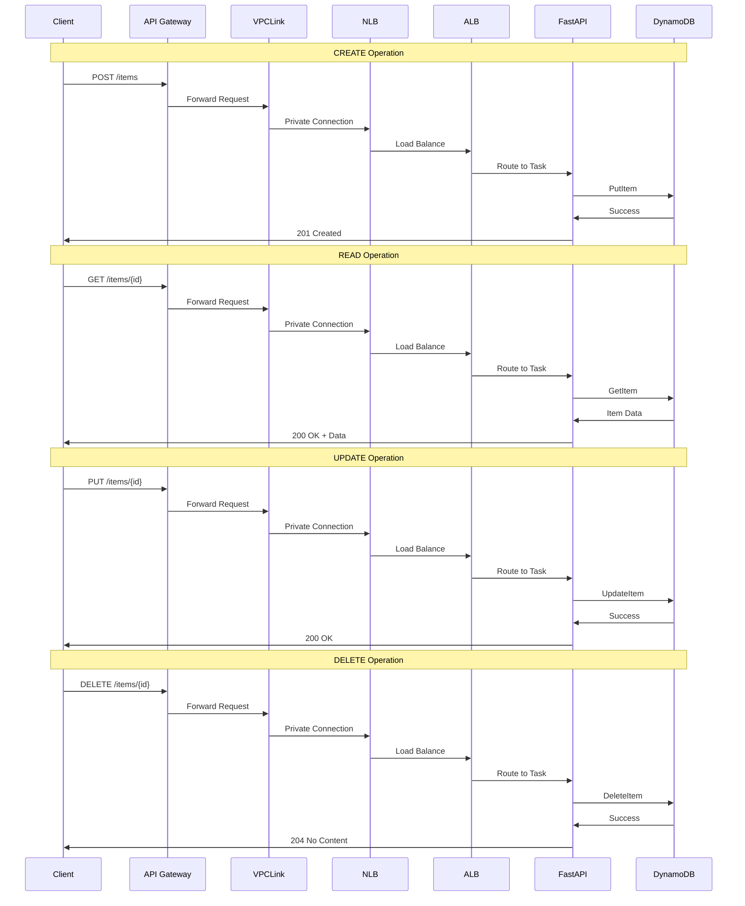
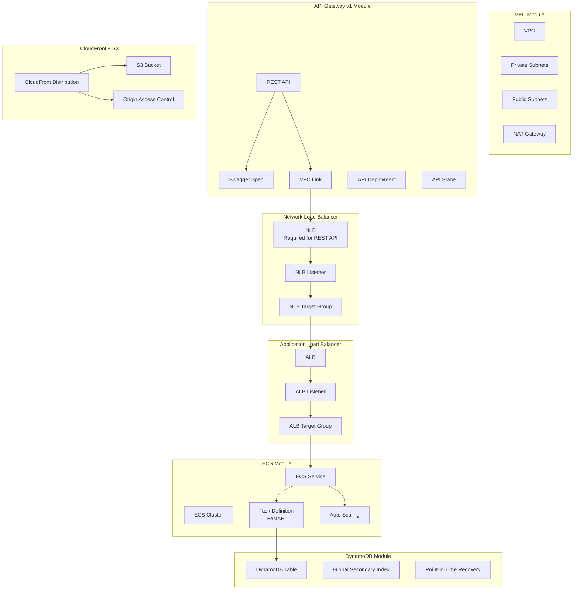
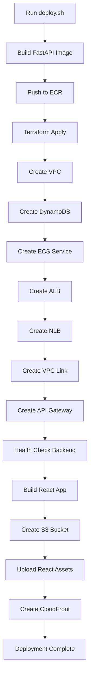

# CRUD API REST Architecture

This document provides a detailed architecture view of the CRUD API with REST API Gateway and React frontend.

## High-Level Architecture

## CRUD Operations Flow

## Terraform Resources

## Deployment Flow

## Cost Breakdown

| Component | Monthly Cost | Notes |
|-----------|--------------|-------|
| NAT Gateway | ~$32 | Single NAT for dev |
| API Gateway REST API | ~$3.50 | 1M requests |
| VPC Link | ~$22 | Per VPC Link |
| Network Load Balancer | ~$16 | Required for REST API |
| Application Load Balancer | ~$20 | Includes data processing |
| Fargate Tasks (2x) | ~$30 | 0.25 vCPU, 0.5 GB each |
| DynamoDB | ~$5 | On-demand, low traffic |
| CloudFront | ~$1 | 1GB transfer |
| S3 Storage | ~$0.50 | React app assets |
| ECR Storage | ~$1 | Container images |
| CloudWatch Logs | ~$5 | 7-day retention |
| **Total** | **~$136/month** | Development configuration |

**Note**: Using HTTP API (v2) instead of REST API (v1) would save ~$16/month by eliminating the NLB requirement.

## Related Documentation

- [Main README](https://github.com/jonmatum/terraform-aws-serverless-modules/tree/main/examples/crud-api-rest/README.md)
- [API Gateway v1 Module](https://github.com/jonmatum/terraform-aws-serverless-modules/tree/main/modules/api-gateway-v1)
- [DynamoDB Module](https://github.com/jonmatum/terraform-aws-serverless-modules/tree/main/modules/dynamodb)
- [CloudFront + S3 Module](https://github.com/jonmatum/terraform-aws-serverless-modules/tree/main/modules/cloudfront-s3)
- [ECS Module](https://github.com/jonmatum/terraform-aws-serverless-modules/tree/main/modules/ecs)
