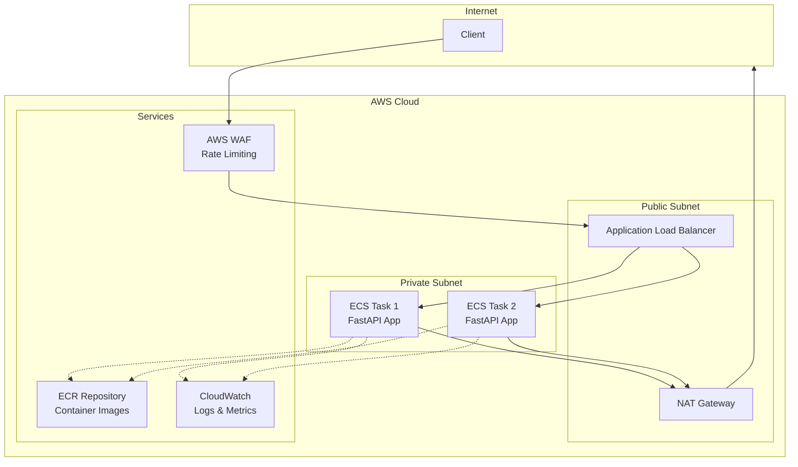
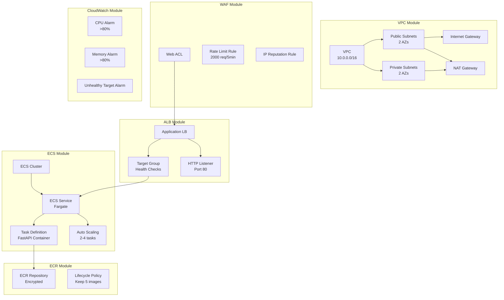
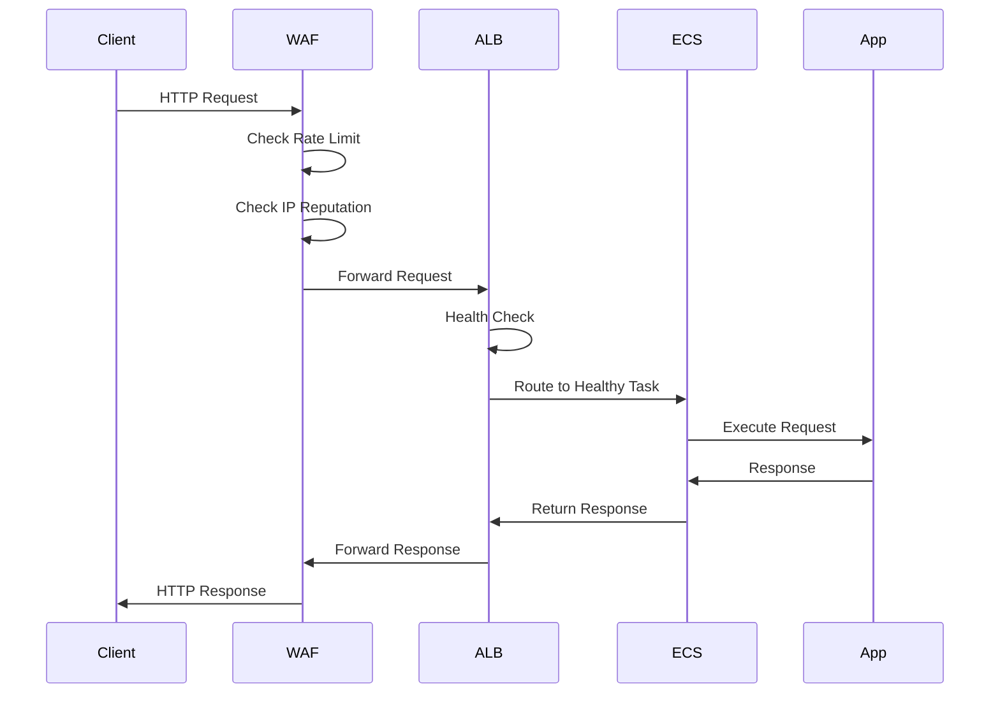
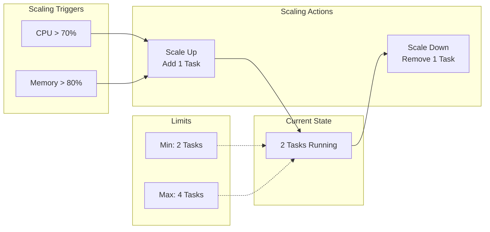
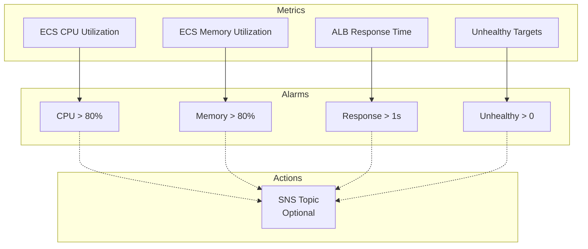
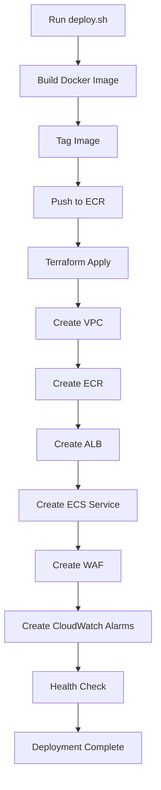

# ECS App Architecture

This document provides a detailed architecture view of the ECS application example.

## High-Level Architecture

## Terraform Resources

## Request Flow

## Auto-Scaling Behavior

## Monitoring & Alarms

## Deployment Flow

## Cost Breakdown

| Component | Monthly Cost | Notes |
|-----------|--------------|-------|
| NAT Gateway | ~$32 | Single NAT for dev |
| Fargate Tasks (2x) | ~$30 | 0.25 vCPU, 0.5 GB each |
| ALB | ~$20 | Includes data processing |
| ECR Storage | ~$1 | 5 images retained |
| CloudWatch Logs | ~$5 | 7-day retention |
| Data Transfer | Variable | Depends on traffic |
| **Total** | **~$88/month** | Development configuration |

## Related Documentation

- [Main README](./README.md)
- [VPC Module](../../modules/vpc/)
- [ECS Module](../../modules/ecs/)
- [ALB Module](../../modules/alb/)
- [WAF Module](../../modules/waf/)
