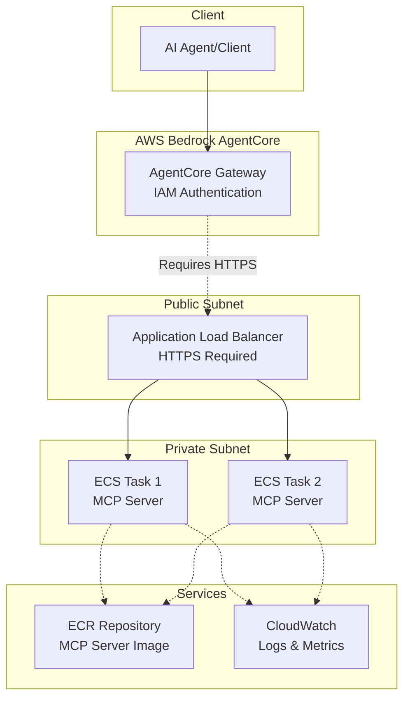
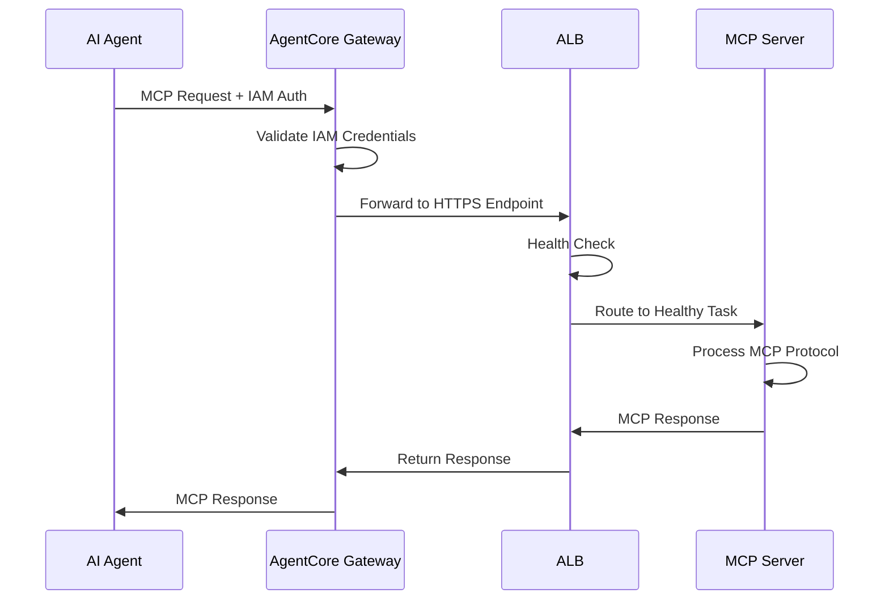
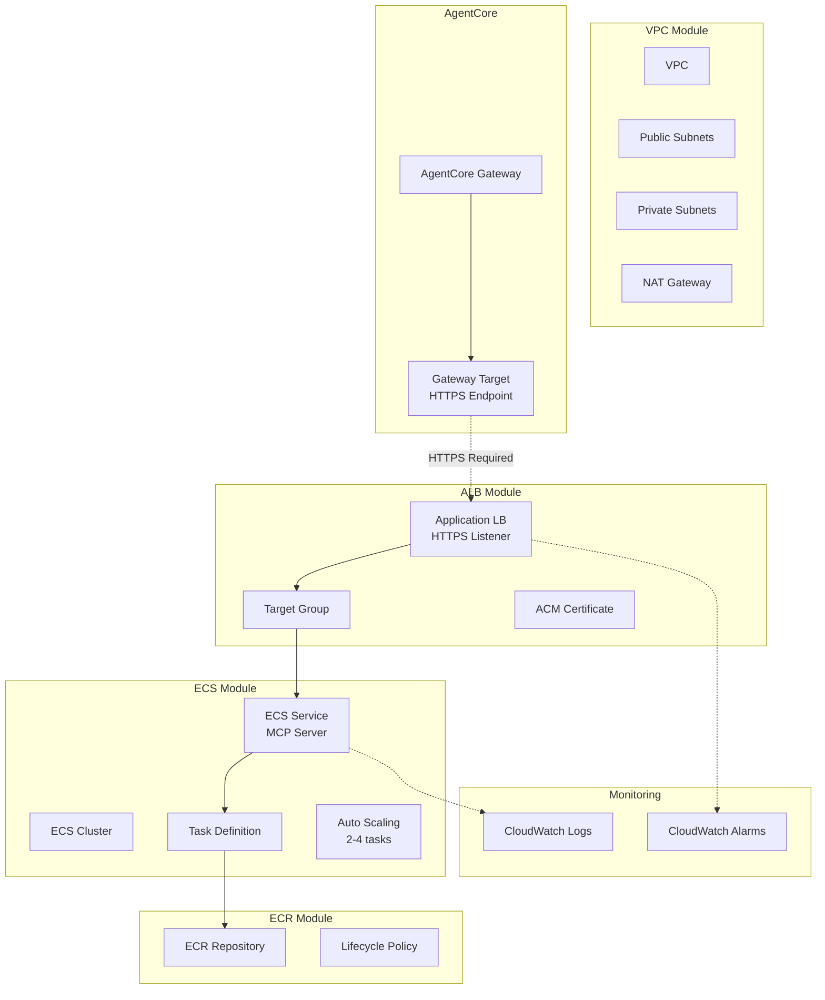
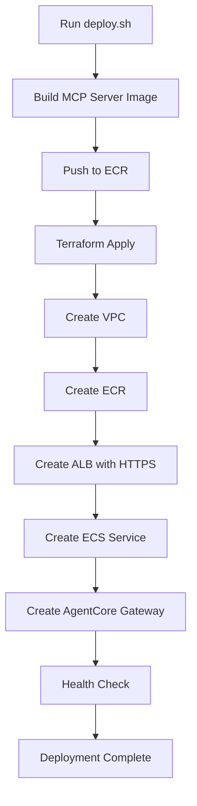

# MCP Agent Runtime Architecture

This document provides a detailed architecture view of the MCP (Model Context Protocol) agent runtime on ECS Fargate.

## High-Level Architecture

## MCP Protocol Flow

## Terraform Resources

## Deployment Flow

## Cost Breakdown

| Component | Monthly Cost | Notes |
|-----------|--------------|-------|
| NAT Gateway | ~$32 | Single NAT for dev |
| Fargate Tasks (2x) | ~$30 | 0.25 vCPU, 0.5 GB each |
| ALB | ~$20 | Includes data processing |
| AgentCore Gateway | ~$0 | Pay per request |
| ECR Storage | ~$1 | Container images |
| CloudWatch Logs | ~$5 | 7-day retention |
| ACM Certificate | ~$0 | Free for public certs |
| **Total** | **~$88/month** | Development configuration |

## Production Considerations

- Configure HTTPS listener on ALB with ACM certificate
- Use custom domain with Route 53
- Enable WAF for additional security
- Implement request throttling
- Set up CloudWatch alarms for monitoring
- Use Secrets Manager for sensitive configuration

## Related Documentation

- [Main README](https://github.com/jonmatum/terraform-aws-serverless-modules/tree/main/examples/mcp-agent-runtime/README.md)
- [VPC Module](https://github.com/jonmatum/terraform-aws-serverless-modules/tree/main/modules/vpc)
- [ECS Module](https://github.com/jonmatum/terraform-aws-serverless-modules/tree/main/modules/ecs)
- [ALB Module](https://github.com/jonmatum/terraform-aws-serverless-modules/tree/main/modules/alb)
- [MCP Protocol Specification](https://modelcontextprotocol.io/)
