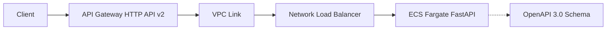

# OpenAPI HTTP API Example

FastAPI application with automatic OpenAPI schema import to API Gateway HTTP API (v2).

## Architecture



## Features

- FastAPI app with multiple CRUD endpoints
- Automatic OpenAPI/Swagger schema generation
- API Gateway HTTP API configured from OpenAPI spec
- Full REST API for user management (GET, POST, PUT, DELETE)
- VPC Link integration with NLB

## How It Works

1. FastAPI generates OpenAPI 3.0 schema
2. Terraform extracts schema and configures API Gateway
3. API Gateway routes defined by OpenAPI spec
4. VPC Link connects to ECS service via NLB

## Deployment

### Prerequisites

- AWS CLI configured with appropriate credentials
- Docker installed and running
- Terraform >= 1.0

### Initial Deployment

```bash
./deploy.sh
```

This will:
1. Create ECR repository
2. Build and push Docker image
3. Deploy infrastructure with API Gateway configured from OpenAPI spec
4. Deploy ECS service

### Redeploy After Code Changes

```bash
./redeploy.sh
```

## Testing

```bash
API_ENDPOINT=$(terraform output -raw api_endpoint)

# List users
curl $API_ENDPOINT/users

# Get user
curl $API_ENDPOINT/users/1

# Create user
curl -X POST $API_ENDPOINT/users \
  -H "Content-Type: application/json" \
  -d '{"name":"Alice","email":"alice@example.com"}'

# Update user
curl -X PUT $API_ENDPOINT/users/1 \
  -H "Content-Type: application/json" \
  -d '{"name":"John Updated"}'

# Delete user
curl -X DELETE $API_ENDPOINT/users/2
```

## OpenAPI Spec

The OpenAPI specification is automatically generated at `openapi.json` during deployment. View it to see all available endpoints and schemas.

## Local Development

```bash
pip install -r requirements.txt
uvicorn app:app --reload

# View docs at http://localhost:8000/docs
```
<!-- BEGINNING OF PRE-COMMIT-TERRAFORM DOCS HOOK -->
## Requirements

| Name | Version |
|------|---------|
| <a name="requirement_terraform"></a> [terraform](#requirement\_terraform) | >= 1.0 |
| <a name="requirement_aws"></a> [aws](#requirement\_aws) | ~> 6.0 |
| <a name="requirement_local"></a> [local](#requirement\_local) | ~> 2.0 |
| <a name="requirement_null"></a> [null](#requirement\_null) | ~> 3.0 |

## Providers

| Name | Version |
|------|---------|
| <a name="provider_aws"></a> [aws](#provider\_aws) | 6.33.0 |
| <a name="provider_local"></a> [local](#provider\_local) | 2.7.0 |
| <a name="provider_null"></a> [null](#provider\_null) | 3.2.4 |

## Modules

| Name | Source | Version |
|------|--------|---------|
| <a name="module_ecr"></a> [ecr](#module\_ecr) | ../../modules/ecr | n/a |
| <a name="module_ecs"></a> [ecs](#module\_ecs) | ../../modules/ecs | n/a |
| <a name="module_vpc"></a> [vpc](#module\_vpc) | ../../modules/vpc | n/a |

## Resources

| Name | Type |
|------|------|
| [aws_apigatewayv2_api.this](https://registry.terraform.io/providers/hashicorp/aws/latest/docs/resources/apigatewayv2_api) | resource |
| [aws_apigatewayv2_integration.this](https://registry.terraform.io/providers/hashicorp/aws/latest/docs/resources/apigatewayv2_integration) | resource |
| [aws_apigatewayv2_route.default](https://registry.terraform.io/providers/hashicorp/aws/latest/docs/resources/apigatewayv2_route) | resource |
| [aws_apigatewayv2_stage.default](https://registry.terraform.io/providers/hashicorp/aws/latest/docs/resources/apigatewayv2_stage) | resource |
| [aws_apigatewayv2_vpc_link.this](https://registry.terraform.io/providers/hashicorp/aws/latest/docs/resources/apigatewayv2_vpc_link) | resource |
| [aws_cloudwatch_log_group.this](https://registry.terraform.io/providers/hashicorp/aws/latest/docs/resources/cloudwatch_log_group) | resource |
| [aws_iam_role.ecs_execution](https://registry.terraform.io/providers/hashicorp/aws/latest/docs/resources/iam_role) | resource |
| [aws_iam_role_policy.ecs_execution_custom](https://registry.terraform.io/providers/hashicorp/aws/latest/docs/resources/iam_role_policy) | resource |
| [aws_iam_role_policy_attachment.ecs_execution](https://registry.terraform.io/providers/hashicorp/aws/latest/docs/resources/iam_role_policy_attachment) | resource |
| [aws_lb.nlb](https://registry.terraform.io/providers/hashicorp/aws/latest/docs/resources/lb) | resource |
| [aws_lb_listener.this](https://registry.terraform.io/providers/hashicorp/aws/latest/docs/resources/lb_listener) | resource |
| [aws_lb_target_group.this](https://registry.terraform.io/providers/hashicorp/aws/latest/docs/resources/lb_target_group) | resource |
| [aws_security_group.ecs_tasks](https://registry.terraform.io/providers/hashicorp/aws/latest/docs/resources/security_group) | resource |
| [aws_security_group.vpc_link](https://registry.terraform.io/providers/hashicorp/aws/latest/docs/resources/security_group) | resource |
| [null_resource.generate_openapi](https://registry.terraform.io/providers/hashicorp/null/latest/docs/resources/resource) | resource |
| [aws_availability_zones.available](https://registry.terraform.io/providers/hashicorp/aws/latest/docs/data-sources/availability_zones) | data source |
| [local_file.openapi_spec](https://registry.terraform.io/providers/hashicorp/local/latest/docs/data-sources/file) | data source |

## Inputs

| Name | Description | Type | Default | Required |
|------|-------------|------|---------|:--------:|
| <a name="input_aws_region"></a> [aws\_region](#input\_aws\_region) | AWS region | `string` | `"us-east-1"` | no |
| <a name="input_project_name"></a> [project\_name](#input\_project\_name) | Project name | `string` | `"openapi-http-api"` | no |
| <a name="input_tags"></a> [tags](#input\_tags) | Tags to apply to resources | `map(string)` | `{}` | no |

## Outputs

| Name | Description |
|------|-------------|
| <a name="output_api_endpoint"></a> [api\_endpoint](#output\_api\_endpoint) | API Gateway endpoint URL |
| <a name="output_api_id"></a> [api\_id](#output\_api\_id) | API Gateway ID |
| <a name="output_ecr_repository_url"></a> [ecr\_repository\_url](#output\_ecr\_repository\_url) | ECR repository URL |
| <a name="output_openapi_spec_location"></a> [openapi\_spec\_location](#output\_openapi\_spec\_location) | Location of generated OpenAPI spec |
| <a name="output_test_commands"></a> [test\_commands](#output\_test\_commands) | Commands to test the API |
<!-- END OF PRE-COMMIT-TERRAFORM DOCS HOOK -->
