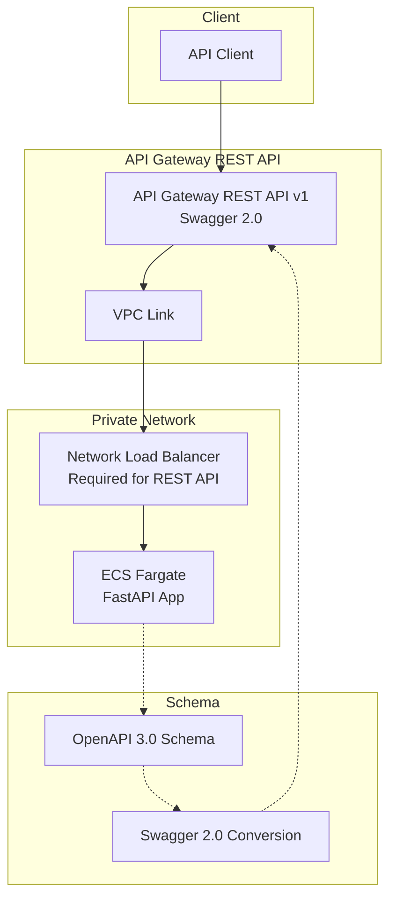
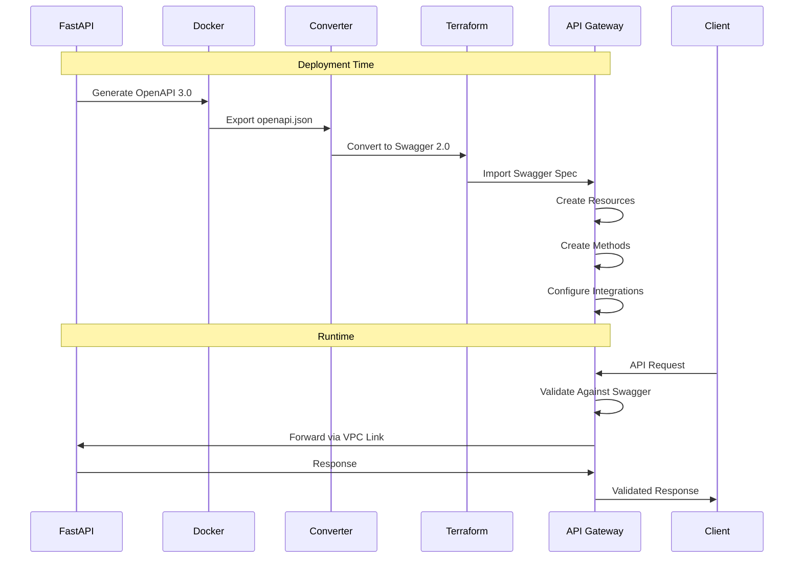
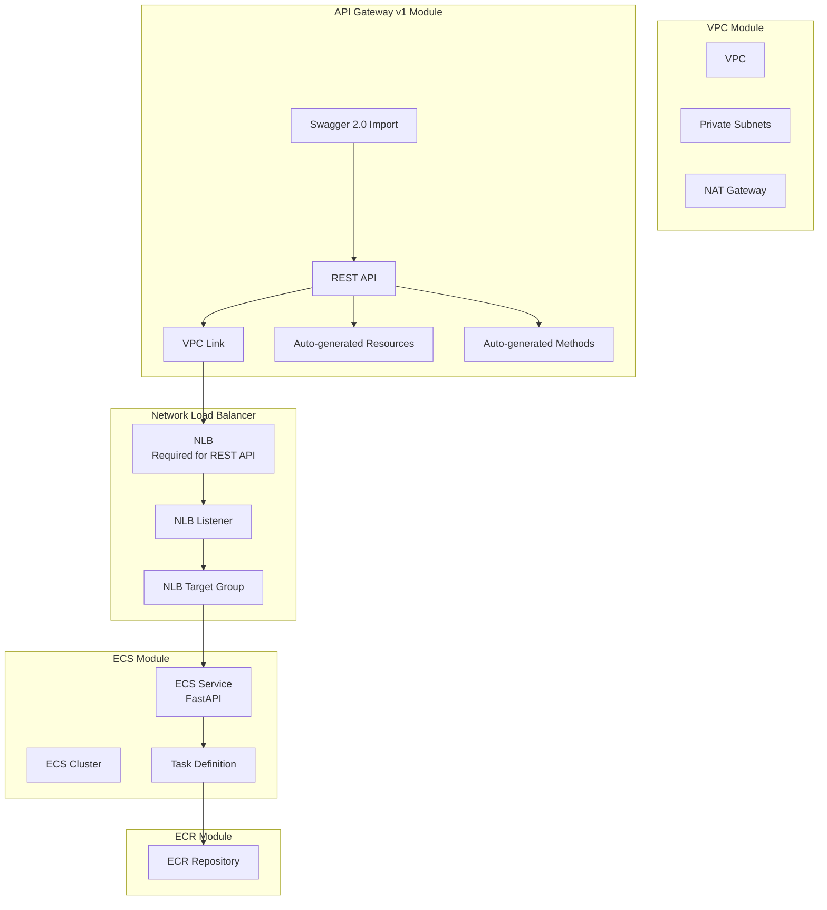
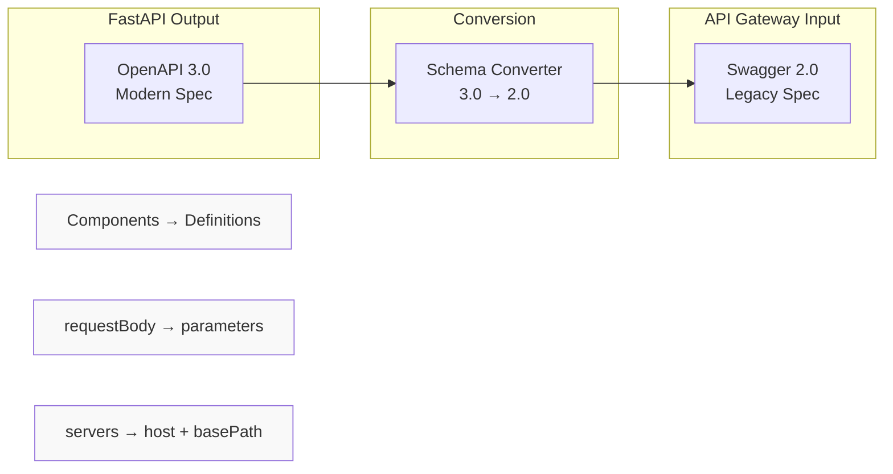

# OpenAPI REST API Architecture

This document provides a detailed architecture view of the OpenAPI REST API example with Swagger 2.0 schema import.

## High-Level Architecture

## Swagger Integration Flow

## Terraform Resources

## OpenAPI to Swagger Conversion

## Cost Breakdown

| Component | Monthly Cost | Notes |
|-----------|--------------|-------|
| NAT Gateway | ~$32 | Single NAT for dev |
| API Gateway REST API | ~$3.50 | 1M requests |
| VPC Link | ~$22 | Per VPC Link |
| Network Load Balancer | ~$16 | Required for REST API |
| Fargate Tasks (2x) | ~$30 | 0.25 vCPU, 0.5 GB each |
| ECR Storage | ~$1 | Container images |
| CloudWatch Logs | ~$5 | 7-day retention |
| **Total** | **~$109/month** | Development configuration |

## Related Documentation

- [Main README](./README.md)
- [API Gateway v1 Module](../../modules/api-gateway-v1/)
- [ECS Module](../../modules/ecs/)
- [Swagger 2.0 Specification](https://swagger.io/specification/v2/)
- [OpenAPI 3.0 Specification](https://spec.openapis.org/oas/v3.0.0)
