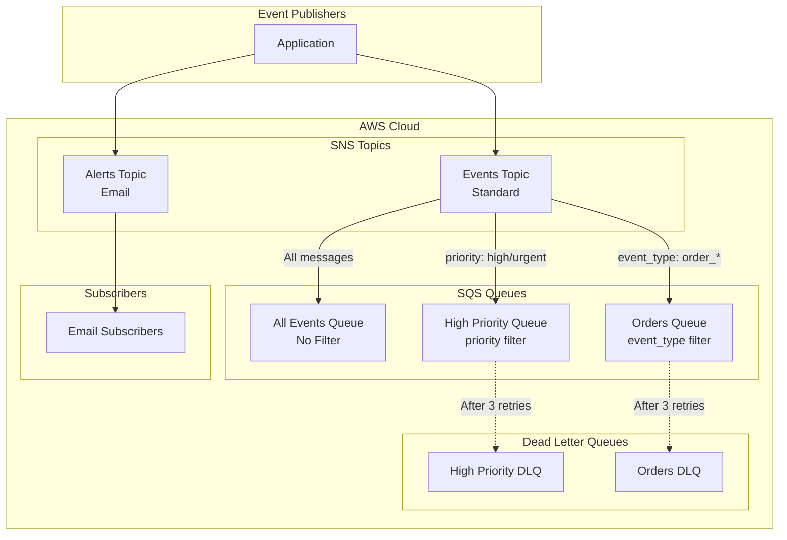
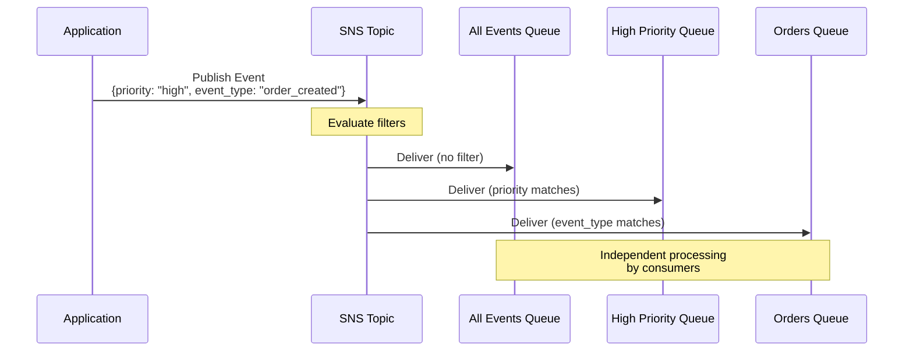
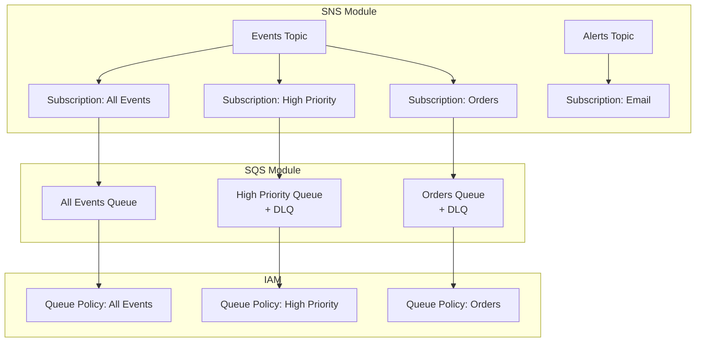

# SNS Fan-out Architecture

## Overview

SNS topic publishing to multiple SQS queues with message filtering for event-driven architecture.

## High-Level Architecture



## Message Flow with Filtering



## Components

### SNS Topics

**Events Topic**
- Publishes application events
- Multiple SQS subscriptions
- Message filtering enabled
- Standard topic (not FIFO)

**Alerts Topic**
- Critical system alerts
- Email subscriptions
- Display name for email subject

### SQS Queues

**All Events Queue**
- Receives all published events
- No message filtering
- Raw message delivery enabled
- Long polling (20 seconds)

**High Priority Queue**
- Receives only high/urgent priority events
- Filter: `priority = ["high", "urgent"]`
- Separate processing pipeline
- Dead letter queue enabled

**Orders Queue**
- Receives only order-related events
- Filter: `event_type = ["order_created", "order_updated"]`
- Dedicated order processing
- Dead letter queue enabled

## Message Flow

### Standard Event Flow

1. Application publishes event to SNS topic
2. SNS evaluates message attributes against filters
3. SNS delivers to matching queues:
   - All Events Queue (always)
   - High Priority Queue (if priority matches)
   - Orders Queue (if event_type matches)
4. Consumers poll respective queues
5. Messages processed independently

### Filtered Event Flow

**High Priority Event:**
```json
{
  "message": "Payment failed",
  "attributes": {
    "priority": "high"
  }
}
```
→ Delivered to: All Events Queue + High Priority Queue

**Order Event:**
```json
{
  "message": "Order created",
  "attributes": {
    "event_type": "order_created"
  }
}
```
→ Delivered to: All Events Queue + Orders Queue

## Terraform Resources



## Message Filtering

### Filter Policy Syntax

```json
{
  "attribute_name": ["value1", "value2"]
}
```

### Supported Operators

- **Exact match**: `["value"]`
- **Multiple values**: `["value1", "value2"]`
- **Numeric range**: `[{"numeric": [">=", 0, "<=", 100]}]`
- **Prefix match**: `[{"prefix": "order_"}]`
- **Anything-but**: `[{"anything-but": ["value"]}]`

## Benefits

1. **Decoupling**: Publishers don't know about consumers
2. **Scalability**: Add consumers without changing publishers
3. **Filtering**: Reduce unnecessary processing
4. **Reliability**: Each queue has independent DLQ
5. **Cost Optimization**: Process only relevant messages

## Best Practices

1. **Use message attributes** for filtering (not message body)
2. **Enable raw message delivery** for SQS to avoid JSON wrapping
3. **Monitor DLQs** for failed deliveries
4. **Set appropriate retention** based on processing SLA
5. **Use separate topics** for different event categories
6. **Document filter policies** for consumers

## Monitoring

- SNS publish success/failure
- Number of messages published
- Number of notifications delivered
- SQS queue depth per queue
- DLQ message count
- Message age
