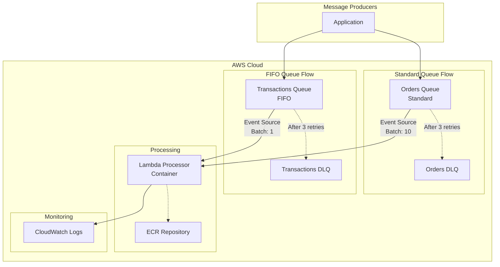
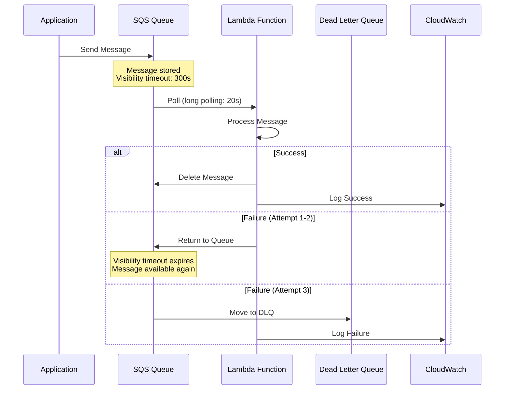
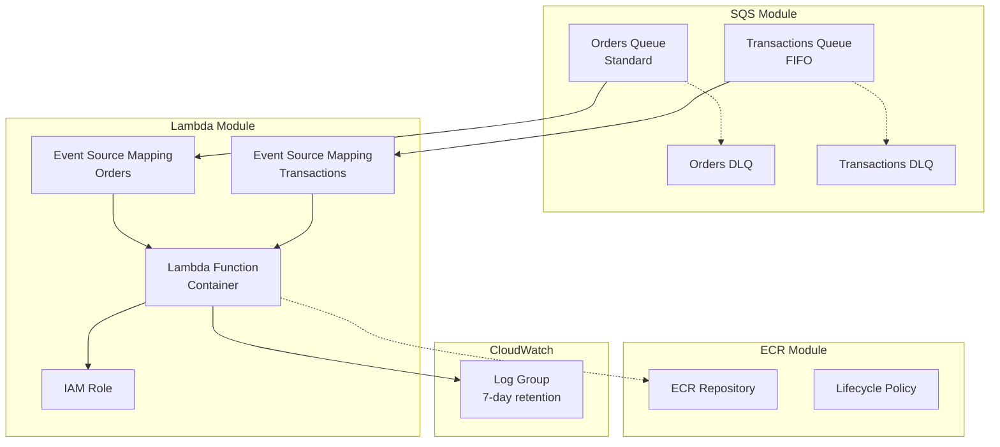

# SQS Queue Architecture

## Overview

Lambda function processing messages from SQS queues with automatic retries and dead letter queue handling.

## High-Level Architecture

## Message Flow

## Components

### SQS Queues

**Orders Queue (Standard)**
- Parallel message processing
- At-least-once delivery
- Best-effort ordering
- Batch size: 10 messages
- Visibility timeout: 300 seconds

**Transactions Queue (FIFO)**
- Sequential message processing
- Exactly-once delivery
- Strict ordering within message group
- Batch size: 1 message
- Content-based deduplication

### Dead Letter Queues

- Captures messages after 3 failed processing attempts
- 14-day message retention
- Same encryption as main queue
- Enables manual inspection and reprocessing

### Lambda Processor

- Container-based function (Python 3.11)
- 512 MB memory
- 300 second timeout
- Event source mapping for both queues
- CloudWatch Logs integration

## Message Flow

### Standard Queue Flow

1. Message sent to Orders Queue
2. Lambda polls queue (long polling: 20s)
3. Lambda receives batch of up to 10 messages
4. Lambda processes messages in parallel
5. On success: Messages deleted from queue
6. On failure: Message returned to queue (visibility timeout)
7. After 3 failures: Message moved to DLQ

### FIFO Queue Flow

1. Message sent to Transactions Queue with message group ID
2. Lambda polls queue
3. Lambda receives 1 message at a time
4. Lambda processes message
5. On success: Message deleted, next message in group processed
6. On failure: Message returned to queue
7. After 3 failures: Message moved to DLQ

## Terraform Resources

## Retry Strategy

- **Visibility Timeout**: 300 seconds (5 minutes)
- **Max Receive Count**: 3 attempts
- **Backoff**: Automatic via visibility timeout
- **DLQ**: Captures failed messages for investigation

## Monitoring

- Lambda invocation metrics
- SQS queue depth
- DLQ message count
- Processing duration
- Error rates

## Best Practices

1. **Visibility Timeout** should be > Lambda timeout
2. **Long Polling** reduces costs and latency
3. **Batch Size** balances throughput and latency
4. **DLQ Monitoring** alerts on failed messages
5. **Idempotency** handles duplicate messages
